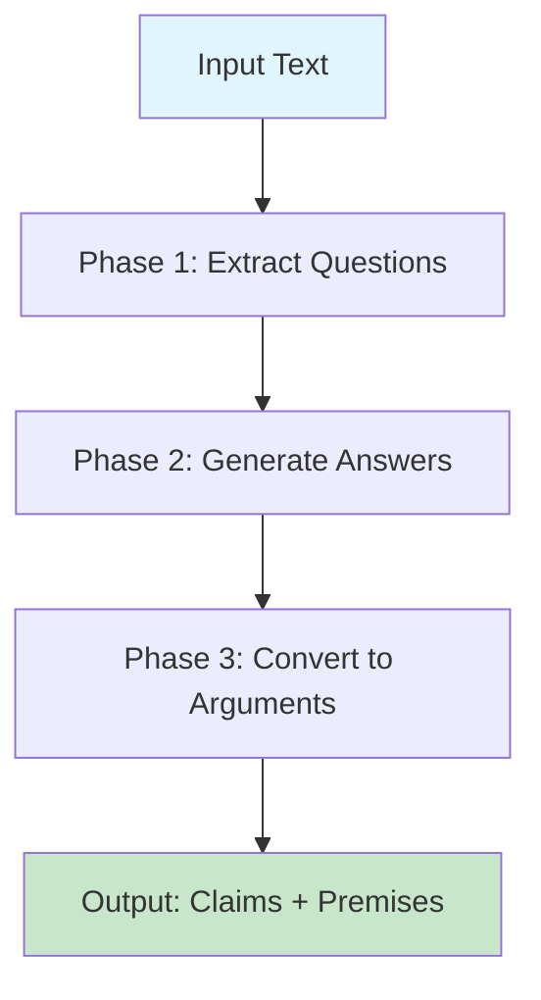
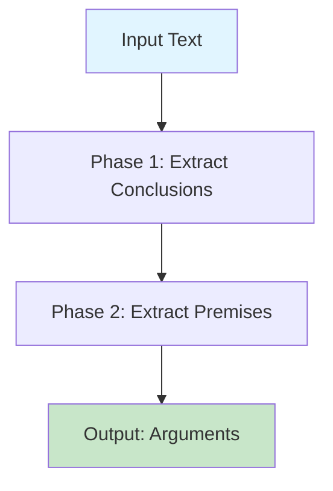
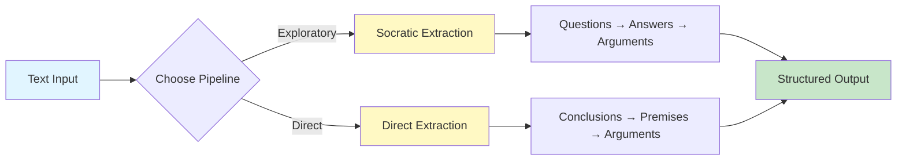
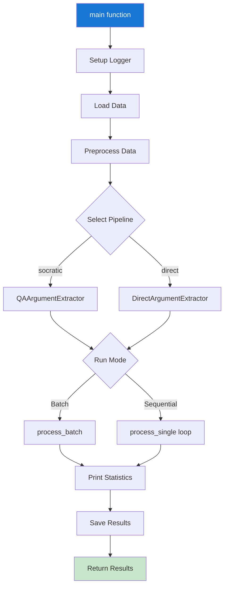
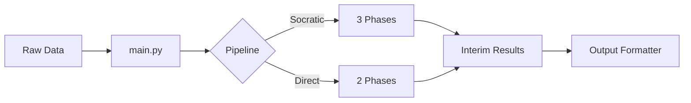

# Economist Communication Analysis

Analysis tools for economic communication research, including automated argumentation mining, text analysis, and data processing pipelines.

## Table of Contents

- [Overview](#overview)
- [Installation](#installation)
- [Projects](#projects)
  - [Argumentation Mining](#argumentation-mining)
- [Project Structure](#project-structure)

## Overview

This repository contains tools and pipelines for analyzing economists (and others!) op-ed texts. Currently includes automated argumentation mining using LLM-based extraction strategies.

## Installation

### Prerequisites

- Python ~3.10
- OpenAI API key

### Setup

1. Clone the repository:
```bash
git clone <repository-url>
cd econ_comm_analysis
```

2. Install dependencies using uv:
```bash
uv sync
```

3. Create `.env` file with your OpenAI API key:
```bash
OPENAI_API_KEY=your_api_key_here
```

---

## Projects

### Argumentation Mining

Automated extraction of argumentative structures from text using LLM-based pipelines. Two extraction strategies available: Socratic (question-answer based) and Direct (conclusion-premise based).

#### Pipelines

### Socratic Extraction Pipeline

Question-answer based approach that extracts arguments through a three-phase process.



**Phases:**
1. **Question Extraction**: Identifies key questions the text addresses
2. **Answer Generation**: Generates answers using full article context
3. **Argument Structuring**: Converts Q&A pairs into claim-premise structures

### Direct Extraction Pipeline

Direct approach that extracts conclusions and their supporting premises.



**Phases:**
1. **Conclusion Extraction**: Identifies all main conclusions/claims in text
2. **Premise Extraction**: For each conclusion, extracts supporting premises

### Pipeline Comparison



#### Usage

### Using the Main Function

The `main()` function in `src/argumentation_mining/main.py` provides a complete pipeline runner:

```python
from argumentation_mining.main import main

# Run with default settings (Socratic pipeline, batch mode)
results = main(
    data_file="./data/raw/columns_chi2_w_inter.xlsx",
    text_column="Cuerpo",
    id_column="id",
    pipeline_name="socratic_extraction",  # or "direct_extraction"
    output_dir="./data/processed",
    output_format="json",  # "json", "csv", or "both"
    run_batch=True,  # True for batch, False for sequential
    num_rows=10  # Process subset, None for all rows
)
```

**Parameters:**
- `data_file`: Path to input data (Excel or CSV)
- `text_column`: Column name containing text to analyze
- `id_column`: Column name for unique identifiers
- `pipeline_name`: "socratic_extraction" or "direct_extraction"
- `output_dir`: Directory for output files
- `output_format`: Output format ("json", "csv", "both")
- `log_file`: Path to log file
- `run_batch`: Batch processing (True) or sequential (False)
- `num_rows`: Number of rows to process (None = all)

### Main Function Flow



### Command Line Usage

```bash
# From project root
python -m argumentation_mining.main

# Or modify the __main__ block in main.py to customize parameters
```

### Programmatic Usage

#### Socratic Extraction Example

```python
from argumentation_mining.pipelines.socratic_extraction import QAArgumentExtractor

# Initialize extractor
extractor = QAArgumentExtractor(model="gpt-4o-mini")

# Process single text
result = extractor.process_single(
    text="Your text here...",
    article_id="article_001"
)

# Access results
if result.success:
    print(f"Questions: {result.questions}")
    print(f"Arguments: {result.arguments}")

# Batch processing
articles = [
    {"text": "Text 1", "article_id": "001"},
    {"text": "Text 2", "article_id": "002"}
]
results = extractor.process_batch(
    articles=articles,
    text_column="text",
    id_column="article_id",
    output_dir="./data/interim"
)
```

#### Direct Extraction Example

```python
from argumentation_mining.pipelines.direct_extraction import DirectArgumentExtractor

# Initialize extractor
extractor = DirectArgumentExtractor(model="gpt-4o-mini")

# Process single text
result = extractor.process_single(
    text="Your text here...",
    article_id="article_001"
)

# Access results
if result.success:
    print(f"Conclusions: {result.conclusions}")
    print(f"Arguments: {result.arguments}")
```

### Examples

See the `examples/` directory for complete working examples:
- `direct_extraction_example.py`: Direct pipeline usage
- `socratic_extraction_example.py`: Socratic pipeline usage

#### Configuration

**Environment Variables**

Create a `.env` file:
```
OPENAI_API_KEY=your_api_key_here
```

**Prompt Customization**

Edit YAML files in `src/argumentation_mining/pipelines/*/prompt.yaml` to customize:
- System instructions
- Few-shot examples
- Output format specifications

**Model Selection**

Both pipelines support any OpenAI chat model:
```python
extractor = QAArgumentExtractor(model="gpt-4o-mini")  # Default
extractor = DirectArgumentExtractor(model="gpt-4")    # More capable
```

**Batch Processing**

Batch mode uses OpenAI's Batch API for cost-effective processing:
- 50% cost reduction
- Asynchronous processing
- Automatic retry handling
- Results saved to `data/interim/` during processing

**Output Formats**

Results can be saved as:
- **JSON**: Full structured data with nested arguments
- **CSV**: Flattened format for spreadsheet analysis
- **Both**: Generate both formats simultaneously

#### Data Flow


**examples/**
- Standalone scripts demonstrating pipeline usage
- Useful for testing and understanding API

**notebooks/**
- Jupyter notebooks for data exploration and analysis

**reports/**
- Big analysis outputs and logs

---

## Contributing

When adding new analysis tools or pipelines:

1. Create a new module under `src/`
2. Add examples to `examples/`
3. Update this README with usage documentation
4. Include any new dependencies in `pyproject.toml` for testing and understanding API

-------- 


## Configuration

### Environment Variables

Create a `.env` file:
```
OPENAI_API_KEY=your_api_key_here
```

### Prompt Customization

Edit YAML files in `src/argumentation_mining/pipelines/*/prompt.yaml` to customize:
- System instructions
- Few-shot examples
- Output format specifications

### Model Selection

Both pipelines support any OpenAI chat model:
```python
extractor = QAArgumentExtractor(model="gpt-4o-mini")  # Default
extractor = DirectArgumentExtractor(model="gpt-4")    # More capable
```

### Batch Processing

Batch mode uses OpenAI's Batch API for cost-effective processing:
- 50% cost reduction
- Asynchronous processing
- Automatic retry handling
- Results saved to `data/interim/` during processing

### Output Formats

Results can be saved as:
- **JSON**: Full structured data with nested arguments
- **CSV**: Flattened format for spreadsheet analysis
- **Both**: Generate both formats simultaneously
