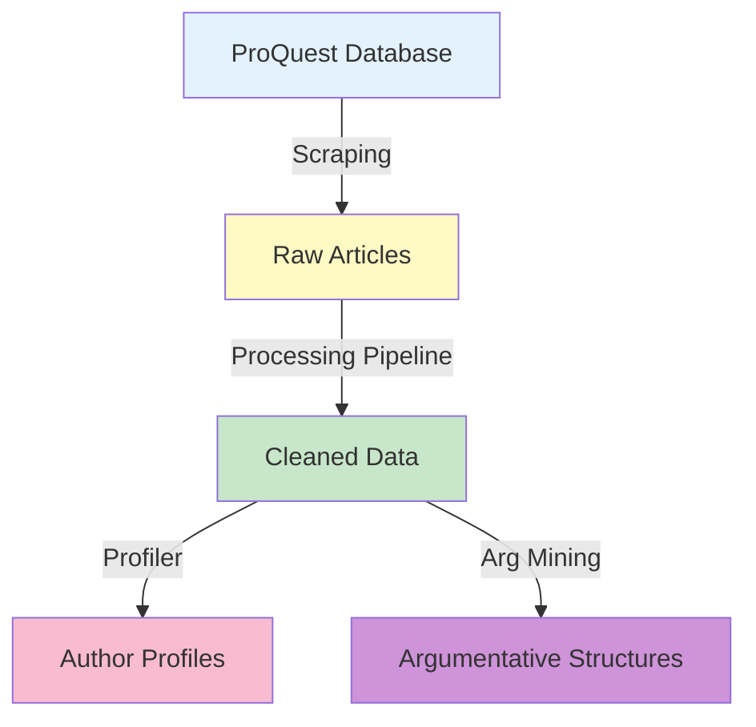

# Economist Communication Analysis

> **IMPORTANT:** Only the **Argumentation Mining** module is currently functional. Other modules are being migrated to the new repository structure.

---

## Table of Contents

- [Overview](#overview)
- [Project Status](#project-status)
- [Installation](#installation)
- [Project Modules](#project-modules)
- [Project Structure](#project-structure)
- [Contributing](#contributing)

---

## Overview

This repository provides a suite of tools for collecting, processing, and analyzing opinion articles from major U.S. newspapers. The project combines web scraping, data processing pipelines, professional profiling, and advanced argumentation mining using Large Language Models.

**Research Focus:**
- Analyzing argumentative structures in economic opinion pieces
- Understanding how economists communicate with the public
- Building comprehensive profiles of opinion article authors
- Processing and normalizing large-scale article datasets

---

## Project Status

| Module | Status | Documentation |
|--------|--------|---------------|
| **Argumentation Mining** | **Fully Functional** | [README](src/argumentation_mining/README.md) |
| **Article Processing Pipeline** | Migration in Progress | [README](src/article_processing_pipeline/README.md) |
| **Professional Profiler** | Migration in Progress | [README](src/professional_profiler/README.md) |
| **ProQuest Scraping** | Migration in Progress | [README](src/proquest_scraping/README.md) |

**Legend:**
- **Bold**: Ready to use
- *Italic*: Under active development
- Regular: Planned/Not functional

---

## Installation

### Prerequisites

- **Python ~3.10**
- **UV** package manager ([installation guide](docs/TOOLS.md#installation))
- **OpenAI API key** (for Argumentation Mining module)
- **Universidad de los Andes institutional access** (for ProQuest scraping module)

### Quick Start

1. **Clone the repository:**
   ```bash
   git clone <repository-url>
   cd econ_comm_analysis
   ```

2. **Install UV** (if not already installed):
   ```bash
   # macOS/Linux
   curl -LsSf https://astral.sh/uv/install.sh | sh
   
   # Windows
   powershell -c "irm https://astral.sh/uv/install.ps1 | iex"
   ```

3. **Install dependencies:**

   This project uses **dependency groups** to organize module-specific dependencies. You can install what you need:

   ```bash
   # Option 1: Install everything (all modules + dev tools)
   uv sync
   
   # Option 2: Install only base dependencies + specific module(s)
   uv sync --group argumentation_mining
   uv sync --group argumentation_mining --group dev
   
   # Option 3: Install only for development
   uv sync --group dev
   ```

   **Available dependency groups:**
   - `argumentation_mining` - LLM-based argument extraction (functional)
   - `article_processing_pipeline` - Article ETL pipeline (in migration)
   - `professional_profiler` - Author credential extraction (in migration)
   - `proquest_scraping` - Web scraping tools (in migration)
   - `dev` - Development tools (Ruff linter/formatter)

   See [TOOLS.md](docs/TOOLS.md) for detailed dependency management guide.

4. **Configure environment variables:**
   
   Create a `.env` file in the project root:
   ```bash
   OPENAI_API_KEY=your_api_key_here
   ```

5. **Verify installation:**
   ```bash
   # Activate virtual environment (created by UV)
   source .venv/bin/activate  # macOS/Linux
   .venv\Scripts\activate     # Windows
   
   # Or use uv run to run without activating
   uv run python -m argumentation_mining.main
   ```

### Development Tools

This project uses modern Python tooling:
- **UV**: Fast Python package manager (replaces pip)
- **Ruff**: Fast linter and formatter (replaces Flake8, Black, isort)

For detailed information on how to use these tools, see **[TOOLS.md](docs/TOOLS.md)**.

---

## Project Modules

### 1. Argumentation Mining

**Status:** **Fully Functional**

LLM-powered extraction of argumentative structures from text using two distinct strategies:
- **Socratic Extraction**: Question-answer driven approach (3 phases)
- **Direct Extraction**: Conclusion-premise approach (2 phases)

**Features:**
- Batch processing with 50% cost reduction
- Multiple output formats (JSON, CSV)
- Customizable prompts
- Comprehensive logging

**Quick Start:**
```python
from argumentation_mining.main import main

results = main(
    data_file="./data/raw/articles.xlsx",
    text_column="text",
    pipeline_name="socratic_extraction",
    output_format="json"
)
```

**[Full Documentation](src/argumentation_mining/README.md)**

---

### 2. Article Processing Pipeline

**Status:** Migration in Progress

ETL pipeline for processing raw article data scraped from ProQuest.

**Capabilities:**
- Entity extraction (authors, tags, locations)
- Deduplication and normalization
- Author name standardization
- Relationship building (many-to-many)

**Outputs:**
- `articles.csv` - Cleaned articles
- `authors.csv` - Unique author entities
- `tags.csv` - Topic, company, people, location tags
- `rel_authors.csv`, `rel_tags.csv` - Relationships

**[Full Documentation](src/article_processing_pipeline/README.md)**

---

### 3. Professional Profiler

**Status:** Migration in Progress

Three-stage pipeline for extracting professional credentials of opinion article authors from Wikipedia.

**Pipeline Stages:**
1. **Scraping**: Wikipedia API search with fuzzy matching
2. **Parsing**: Regex-based education section extraction
3. **LLM Extraction**: Structured degree information extraction

**Outputs:**
- Author Wikipedia pages
- Education-related text sections
- Structured professional profiles (degree type, field)

**[Full Documentation](src/professional_profiler/README.md)**

---

### 4. ProQuest Scraping

**Status:** Migration in Progress

Automated web scraper for collecting articles from ProQuest database through Universidad de los Andes institutional access.

**Features:**
- DrissionPage-based browser automation
- Configurable search filters
- Batch downloading
- Rate limiting and error handling

**Target Publications:**
- Major U.S. newspapers (New York Times, Washington Post, etc.)
- Opinion/editorial sections
- Configurable date ranges

**[Full Documentation](src/proquest_scraping/README.md)**

---

## Project Structure

```
econ_comm_analysis/
├── README.md                          # This file - project overview
├── pyproject.toml                     # Python dependencies (managed by uv)
├── Makefile                           # Build automation
├── .env                               # Environment variables (create this)
│
├── src/                               # Source code for all modules
│   ├── argumentation_mining/          # [FUNCTIONAL] LLM argument extraction
│   │   ├── README.md                  # Detailed documentation
│   │   ├── main.py                    # Main pipeline runner
│   │   ├── pipelines/                 # Socratic & Direct extractors
│   │   └── utils/                     # Logging, OpenAI calls, formatting
│   │
│   ├── article_processing_pipeline/   # [MIGRATING] ETL pipeline for article data
│   │   ├── README.md
│   │   ├── run_pipeline.py
│   │   └── modules/                   # Cleaning, deduplication, extraction
│   │
│   ├── professional_profiler/         # [MIGRATING] Author credential extraction
│   │   ├── README.md
│   │   ├── config/
│   │   └── professional_profiler/     # Scraping, parsing, LLM extraction
│   │
│   └── proquest_scraping/             # [MIGRATING] Article collection from ProQuest
│       ├── README.md
│       └── webScrapingFinal.ipynb
│
├── data/                              # Data directory (not in version control)
│   ├── raw/                           # Original scraped data
│   ├── interim/                       # Intermediate processing results
│   ├── processed/                     # Final cleaned datasets
│   └── external/                      # External data sources
│
├── examples/                          # Standalone usage examples
│   ├── direct_extraction_example.py
│   └── socratic_extraction_example.py
│
├── notebooks/                         # Jupyter notebooks for exploration
│   └── professional_profiler/
│
├── reports/                           # Analysis outputs and figures
│   └── figures/
│
├── models/                            # Saved model artifacts (if any)
├── references/                        # Documentation and references
└── docs/                              # Additional documentation
    └── TOOLS.md                       # UV and Ruff usage guide
```

---

## Data Flow



**Typical Workflow:**
1. **Scrape** articles from ProQuest → `data/raw/`
2. **Process** with Article Pipeline → `data/processed/`
3. **Profile** authors with Professional Profiler → author credentials
4. **Extract** arguments with Argumentation Mining → structured arguments

---

## Contributing

### Adding New Features

1. Create a new module under `src/` following the existing structure
2. Include a comprehensive README in the module directory
3. Add usage examples to `examples/`
4. Update dependencies in `pyproject.toml`
5. Update this main README with module status and links

### Code Standards

- Follow existing project structure conventions
- Include logging for all major operations
- Write clear docstrings and type hints
- Provide configuration via YAML or environment variables
- Include error handling and validation

### Testing

- Test new modules with sample data
- Verify integration with existing pipelines
- Document any external dependencies or API keys required

---

## Future Development

**Planned Improvements:**
- [ ] Complete migration of all modules to new structure
- [ ] Unified configuration system across modules
- [ ] Comprehensive test suite
- [ ] Docker containerization
- [ ] Web interface for pipeline management
- [ ] Integration of all modules into end-to-end workflow

---

## License

[Add license information]

---

## Contact

[Add contact information]

---

## Acknowledgments

This project is part of research into economic communication at Universidad de los Andes.
