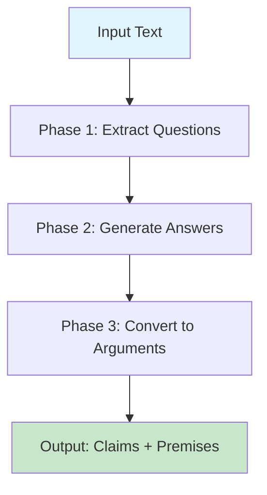
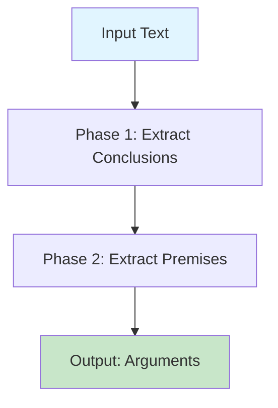
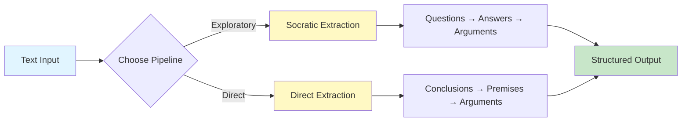
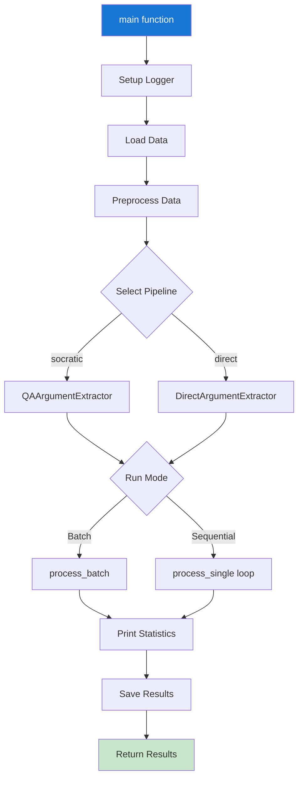
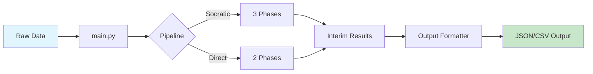

# Argumentation Mining

**Status: Fully Functional**

Automated extraction of argumentative structures from text using LLM-based pipelines. Two extraction strategies available: Socratic (question-answer based) and Direct (conclusion-premise based).

---

## Table of Contents

- [Overview](#overview)
- [Installation](#installation)
- [Pipelines](#pipelines)
  - [Socratic Extraction](#socratic-extraction-pipeline)
  - [Direct Extraction](#direct-extraction-pipeline)
  - [Pipeline Comparison](#pipeline-comparison)
- [Usage](#usage)
  - [Main Function](#using-the-main-function)
  - [Command Line](#command-line-usage)
  - [Programmatic Usage](#programmatic-usage)
  - [Examples](#examples)
- [Configuration](#configuration)
- [Data Flow](#data-flow)

---

## Overview

This module provides LLM-powered tools for extracting argumentative structures from opinion articles and op-eds. It identifies claims, conclusions, and their supporting premises through two distinct extraction strategies.

**Key Features:**
- Two extraction pipelines: Socratic and Direct
- Batch processing with OpenAI Batch API (50% cost reduction)
- Sequential processing for immediate results
- Flexible output formats (JSON, CSV, or both)
- Comprehensive logging and error handling
- Customizable prompts via YAML configuration

---

## Installation

### Prerequisites

- Python ~3.10
- OpenAI API key
- UV package manager (see [TOOLS.md](../../docs/TOOLS.md))

### Setup

1. **Install dependencies** (from project root):

   ```bash
   # Install only argumentation_mining dependencies
   uv sync --group argumentation_mining
   
   # Or install everything
   uv sync
   ```

2. **Create `.env` file** in project root:
   ```bash
   OPENAI_API_KEY=your_api_key_here
   ```

3. **Verify installation**:
   ```bash
   # Activate environment
   source .venv/bin/activate  # macOS/Linux
   .venv\Scripts\activate     # Windows
   
   # Or use uv run
   uv run python -m argumentation_mining.main
   ```

For more details on dependency management, see [TOOLS.md](../../docs/TOOLS.md).

---

## Pipelines

### Socratic Extraction Pipeline

Question-answer based approach that extracts arguments through a three-phase process.



**Phases:**
1. **Question Extraction**: Identifies key questions the text addresses
2. **Answer Generation**: Generates answers using full article context
3. **Argument Structuring**: Converts Q&A pairs into claim-premise structures

**Best For:**
- Exploratory analysis
- When arguments are implicit
- Complex or nuanced texts

---

### Direct Extraction Pipeline

Direct approach that extracts conclusions and their supporting premises.



**Phases:**
1. **Conclusion Extraction**: Identifies all main conclusions/claims in text
2. **Premise Extraction**: For each conclusion, extracts supporting premises

**Best For:**
- Clear argumentative texts
- Faster processing
- Explicit claim-evidence structures

---

### Pipeline Comparison



| Feature | Socratic | Direct |
|---------|----------|--------|
| **Phases** | 3 | 2 |
| **Processing Time** | Longer | Faster |
| **Best For** | Implicit arguments | Explicit arguments |
| **Approach** | Question-driven | Conclusion-driven |

---

## Usage

### Using the Main Function

The `main()` function in `src/argumentation_mining/main.py` provides a complete pipeline runner:

```python
from argumentation_mining.main import main

# Run with default settings (Socratic pipeline, batch mode)
results = main(
    data_file="./data/raw/columns_chi2_w_inter.xlsx",
    text_column="Cuerpo",
    id_column="id",
    pipeline_name="socratic_extraction",  # or "direct_extraction"
    output_dir="./data/processed",
    output_format="json",  # "json", "csv", or "both"
    run_batch=True,  # True for batch, False for sequential
    num_rows=10  # Process subset, None for all rows
)
```

**Parameters:**
- `data_file`: Path to input data (Excel or CSV)
- `text_column`: Column name containing text to analyze
- `id_column`: Column name for unique identifiers
- `pipeline_name`: "socratic_extraction" or "direct_extraction"
- `output_dir`: Directory for output files
- `output_format`: Output format ("json", "csv", "both")
- `log_file`: Path to log file
- `run_batch`: Batch processing (True) or sequential (False)
- `num_rows`: Number of rows to process (None = all)

#### Main Function Flow



---

### Command Line Usage

```bash
# From project root
python -m argumentation_mining.main

# Or modify the __main__ block in main.py to customize parameters
```

---

### Programmatic Usage

#### Socratic Extraction Example

```python
from argumentation_mining.pipelines.socratic_extraction import QAArgumentExtractor

# Initialize extractor
extractor = QAArgumentExtractor(model="gpt-4o-mini")

# Process single text
result = extractor.process_single(
    text="Your text here...",
    article_id="article_001"
)

# Access results
if result.success:
    print(f"Questions: {result.questions}")
    print(f"Arguments: {result.arguments}")

# Batch processing
articles = [
    {"text": "Text 1", "article_id": "001"},
    {"text": "Text 2", "article_id": "002"}
]
results = extractor.process_batch(
    articles=articles,
    text_column="text",
    id_column="article_id",
    output_dir="./data/interim"
)
```

#### Direct Extraction Example

```python
from argumentation_mining.pipelines.direct_extraction import DirectArgumentExtractor

# Initialize extractor
extractor = DirectArgumentExtractor(model="gpt-4o-mini")

# Process single text
result = extractor.process_single(
    text="Your text here...",
    article_id="article_001"
)

# Access results
if result.success:
    print(f"Conclusions: {result.conclusions}")
    print(f"Arguments: {result.arguments}")
```

---

### Examples

See the `examples/` directory in the project root for complete working examples:
- `direct_extraction_example.py`: Direct pipeline usage
- `socratic_extraction_example.py`: Socratic pipeline usage

---

## Configuration

### Environment Variables

Create a `.env` file in the project root:
```
OPENAI_API_KEY=your_api_key_here
```

### Prompt Customization

Edit YAML files to customize prompts:
- **Socratic Pipeline**: 
  - `src/argumentation_mining/pipelines/socratic_extraction/prompts/prompt_1.yaml`
  - `src/argumentation_mining/pipelines/socratic_extraction/prompts/prompt_2.yaml`
- **Direct Pipeline**: 
  - `src/argumentation_mining/pipelines/direct_extraction/prompt.yaml`

Customize:
- System instructions
- Few-shot examples
- Output format specifications

### Model Selection

Both pipelines support any OpenAI chat model:
```python
extractor = QAArgumentExtractor(model="gpt-4o-mini")  # Default, cost-effective
extractor = DirectArgumentExtractor(model="gpt-4")    # More capable, higher cost
```

### Batch Processing

Batch mode uses OpenAI's Batch API for cost-effective processing:
- **50% cost reduction** compared to standard API
- Asynchronous processing (24-hour window)
- Automatic retry handling
- Results saved to `data/interim/` during processing
- Ideal for large datasets

**Trade-offs:**
- Lower cost, parallel processing
- Longer wait time (up to 24 hours)

### Output Formats

Results can be saved as:
- **JSON**: Full structured data with nested arguments
- **CSV**: Flattened format for spreadsheet analysis
- **Both**: Generate both formats simultaneously

---

## Data Flow



**Directory Structure:**
- `data/raw/`: Input data files
- `data/interim/`: Intermediate results from batch processing
- `data/processed/`: Final formatted outputs
- `logs/`: Processing logs

---

## Module Structure

```
argumentation_mining/
├── __init__.py
├── main.py                    # Main pipeline runner
├── pipelines/
│   ├── direct_extraction/
│   │   ├── __init__.py
│   │   ├── direct_extraction.py
│   │   └── prompt.yaml
│   └── socratic_extraction/
│       ├── __init__.py
│       ├── socratic_extraction.py
│       ├── prompt.yaml          # Legacy single prompt
│       └── prompts/
│           ├── prompt_1.yaml    # Phase 1 & 2 prompts
│           └── prompt_2.yaml    # Phase 3 prompts
└── utils/
    ├── __init__.py
    ├── logger.py
    ├── openai_calls.py
    └── output_formatter.py
```

---

## Contributing

When modifying this module:
1. Update prompt YAML files for behavior changes
2. Test both batch and sequential modes
3. Update examples if API changes
4. Run full pipeline on sample data before committing

---

## Troubleshooting

**Issue**: Batch processing stuck  
**Solution**: Check `data/interim/` for batch status files, may need up to 24 hours

**Issue**: API errors  
**Solution**: Verify `.env` file exists and OPENAI_API_KEY is valid

**Issue**: Import errors  
**Solution**: Run from project root, ensure `uv sync` completed

**Issue**: Memory errors on large datasets  
**Solution**: Use batch mode or process in smaller chunks with `num_rows` parameter

---
